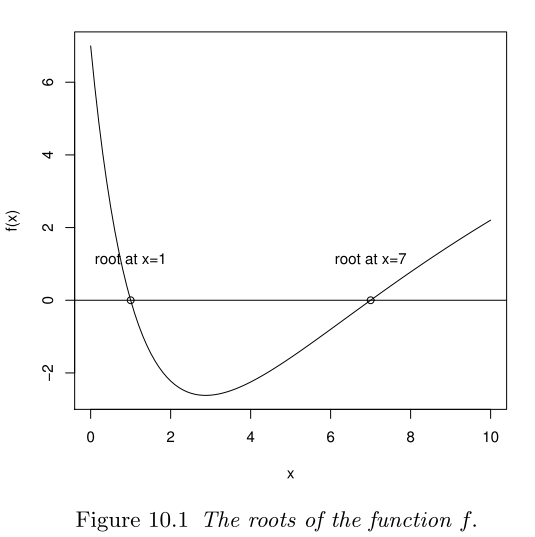
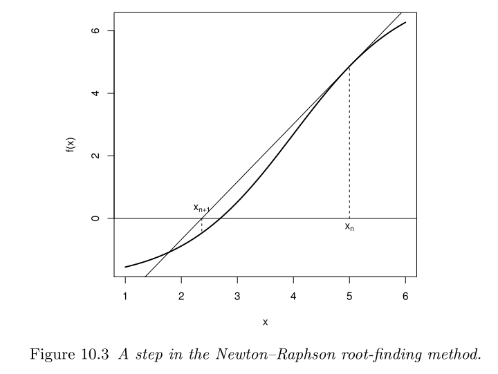

# Overview   
### 1. Root-finding Algorithm      

### 2. Newton’s Method      

### 3. Secant Method           

### 4. Fractals     

### 5. Getting Started - Creating your fractals         

---
# Root-finding Algorithm       

$f(a) = 0$  

$f(x) = g(x)$ `r emo::ji("right_arrow")` $h(x) = f(x) – g(x)$

.center[
```{r, echo=FALSE, out.width="50%", out.height="50%"}
 

```
]  

---

background-image: url(https://upload.wikimedia.org/wikipedia/commons/3/39/GodfreyKneller-IsaacNewton-1689.jpg)
background-position: 95% 10%  
background-size: 20%   

# Newton’s Method       


Our curent "guess" for a: $x_0$ `r emo::ji("right_arrow")` $f'(x_0) = \frac{f(x_0) - y}{x_0 - x}$   
`r emo::ji("right_arrow")` $f'(x_0) = \frac{f(x_0) - 0}{x_0 - x_1}$ `r emo::ji("right_arrow")` $x_1= x_0 - \frac{f(x_0)}{f'(x_0)}$ `r emo::ji("right_arrow")` $x_2= x_1 - \frac{f(x_1)}{f'(x_1)}$  

.center[
```{r, echo=FALSE, out.width="60%", out.height="60%"}
 

```
]  
---
# Newton’s Method

.center[
]

---
# Newton’s Method

<b>
### In general:  
<b>
## $x_{n+1}= x_n - \frac{f(x_n)}{f'(x_n)}$


---
# Newton’s Method     

###  Computational example:   

### Find roots for $x^3-1$    
```{r, eval = F}  

F1 <- function(x){
  return(c(x^3-1, 3*(x^2))) 
}  
```
---
# Newton’s Method     

###  Computational example:   

```{r, eval = F}
newtonraphson <- 
  function(ftn, x0, tol = 1e-9, max.iter) {
  # initialize 
  x <- x0
  fx <- ftn(x)
  iter <- 0
  
  # continue iterating until stopping conditions are met  
  while((abs(fx[1]) > tol) && (iter < max.iter)) {
    x <- x - fx[1]/fx[2]
    fx <- ftn(x)
    iter <- iter + 1
    cat("At iteration", iter, "value of x is:", x, "\n")
  }
  
  # output depends on the success of the algorithm  
  if (abs(fx[1]) > tol){
    cat("Algorithm failed to converge\n")
    return(data.frame(x0, root = NA, iter = NA))
  } else {
    cat("Algorithm converged\n")
    return(data.frame(x0, root = x, iter))
  }
```

---
background-image: url(https://upload.wikimedia.org/wikipedia/commons/thumb/0/06/CIRCLE_LINES.svg/594px-CIRCLE_LINES.svg.png)
background-position: 95% 8%  
background-size: 20%   
# Secant Method        

- Do not need to compute a derivative   
- Need to provide two initial guesses   

<br>

```{r, echo=FALSE, out.width="60%", out.height="60%"}
knitr::include_graphics("https://upload.wikimedia.org/wikipedia/commons/9/92/Secant_method.svg")
```

---
background-image: url(https://upload.wikimedia.org/wikipedia/commons/thumb/0/06/CIRCLE_LINES.svg/594px-CIRCLE_LINES.svg.png)
background-position: 95% 8%  
background-size: 20%   
# Secant Method        
Two initial "guesses" $x_0$ and $x_1$, assuming $x_0$ is the older one   
`r emo::ji("right_arrow")` $\frac{y-f(x_1)}{x-x_1} = \frac{f(x_0) - f(x_1)}{x_0 - x_1}$   
`r emo::ji("right_arrow")` so $x_2$ can be found from $\frac{0-f(x_1)}{x_2-x_1} = \frac{f(x_0) - f(x_1)}{x_0 - x_1}$ `r emo::ji("right_arrow")`  $x_2 = x_1 - f(x_1)\frac{x_0 - x_1}{f(x_0) - f(x_1)}$

```{r, echo=FALSE, out.width="60%", out.height="60%"}
knitr::include_graphics("https://upload.wikimedia.org/wikipedia/commons/9/92/Secant_method.svg")
```

---

# Secant Method     
<b>
### In general:  
<b>
## $x_{n+1} = x_n - f(x_n)\frac{x_n - x_{n-1}}{f(x_n) - f(x_{n-1})}$

---

# Secant Method       

###  Computational example:     

```{r, eval = F}
secant <- function(ftn, x0, x1, tol = 1e-9, max.iter) {
  # initialize 
  x_n0 <- x0
  x_n1 <- x1
  ftn_n0 <- ftn(x_n0)
  ftn_n1 <- ftn(x_n1)
  iter <- 0
  
  # continue iterating until stopping conditions are met  
  while((abs(ftn_n1) > tol) && (iter < max.iter)) {
    x_n2 <- x_n1 - ftn_n1*(x_n1 - x_n0)/(ftn_n1 - ftn_n0)
    x_n0 <- x_n1
    ftn_n0 <- ftn(x_n0)
    x_n1 <- x_n2
    ftn_n1 <- ftn(x_n1)
    iter <- iter + 1
    cat("At iteration", iter, "value of x is:", x_n1, "\n")
  }
  
  return(c(x_n1, iter))
}
```

---

# Fractals      

### Root finding functions can also be applied to find roots for **complex functions**, which are functions of **complex numbers**. 

```{r, echo=FALSE, out.width="50%", out.height="50%"}
knitr::include_graphics("https://upload.wikimedia.org/wikipedia/commons/thumb/a/af/Complex_number_illustration.svg/1024px-Complex_number_illustration.svg.png")
```
---
# Fractals   

### Each root has a **basin of attraction** in the complex plane, which is a set of all **initial guesses** that cause the method to converge to that particular root. 

### These sets can be mapped into images. The boundaries of the basins of attraction are called **fractals**.    

```{r, echo=FALSE, out.width="50%", out.height="50%"}
knitr::include_graphics("https://upload.wikimedia.org/wikipedia/commons/a/a4/Mandelbrot_sequence_new.gif")
```

---
# Fractals 

## Julia set 

```{r, echo=FALSE, out.width="50%", out.height="50%"}
knitr::include_graphics("https://upload.wikimedia.org/wikipedia/commons/thumb/d/d9/Julia_set%2C_plotted_with_Matplotlib.svg/1920px-Julia_set%2C_plotted_with_Matplotlib.svg.png")
```

---
# Fractals 

## Mandelbrot set 

```{r, echo=FALSE, out.width="50%", out.height="50%"}
knitr::include_graphics("https://upload.wikimedia.org/wikipedia/commons/thumb/2/21/Mandel_zoom_00_mandelbrot_set.jpg/1920px-Mandel_zoom_00_mandelbrot_set.jpg")
```
---
# Fractals 

## Burning ship fractals  

```{r, echo=FALSE, out.width="50%", out.height="50%"}
knitr::include_graphics("https://upload.wikimedia.org/wikipedia/commons/9/9a/Burning_Ship_Fractal_Zoom-out_64.gif")
```
---
# Fractals 

## Newton's fractals

```{r, echo=FALSE, out.width="50%", out.height="50%"}
knitr::include_graphics("https://upload.wikimedia.org/wikipedia/commons/9/9b/FRACT008.png")
```
---
# Summary  

### 1. Root-finding algorithm: $h(x) = f(x) – g(x) = 0$ 📐

### 2. Most common: Newton’s Method and Secant method   `r emo::ji("apple")`

### 3. Complex numbers and fractals `r emo::ji("painter")`       

---
# Get Started - Creating your fractals 
<br><br><br>
.center[
  
]

---
# Recommended readings  
-  Introduction to scientific programming and simulation using r, by Andrew P. Robinson, Owen Jones, and Robert Maillardet [[link](http://www.tf.uns.ac.rs/~omorr/radovan_omorjan_003_prII/r-examples/spuRs/spuRs-2ed.pdf)] 

- Newton fractal wiki page  [[link](https://en.wikipedia.org/wiki/Newton_fractal)]

---

class: center, middle,inverse  
# Thanks for attending!   

`r emo::ji("smile")`

### Keep in touch [twitter @kerenxuepi](https://twitter.com/kerenxuepi)  
<br><br><br>
Slides created via **RLadies** **xaringan** slide theme  

